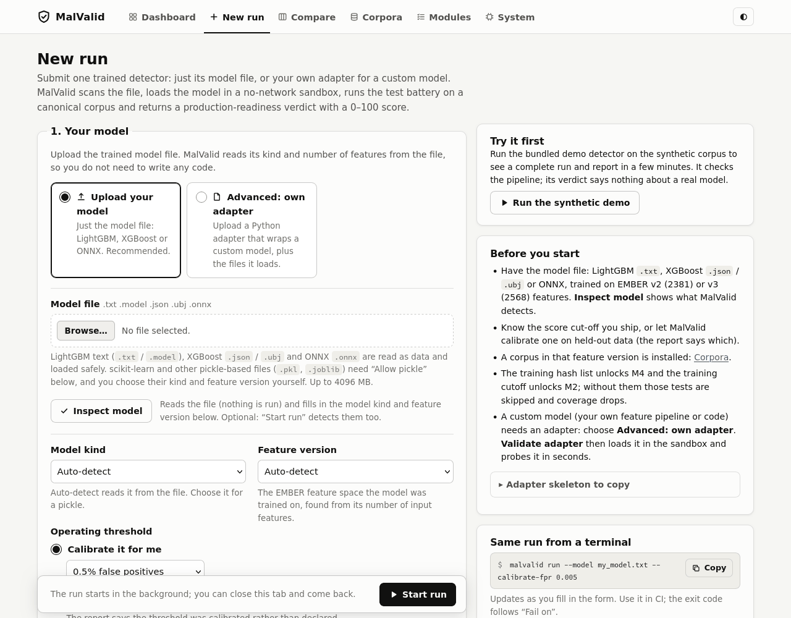
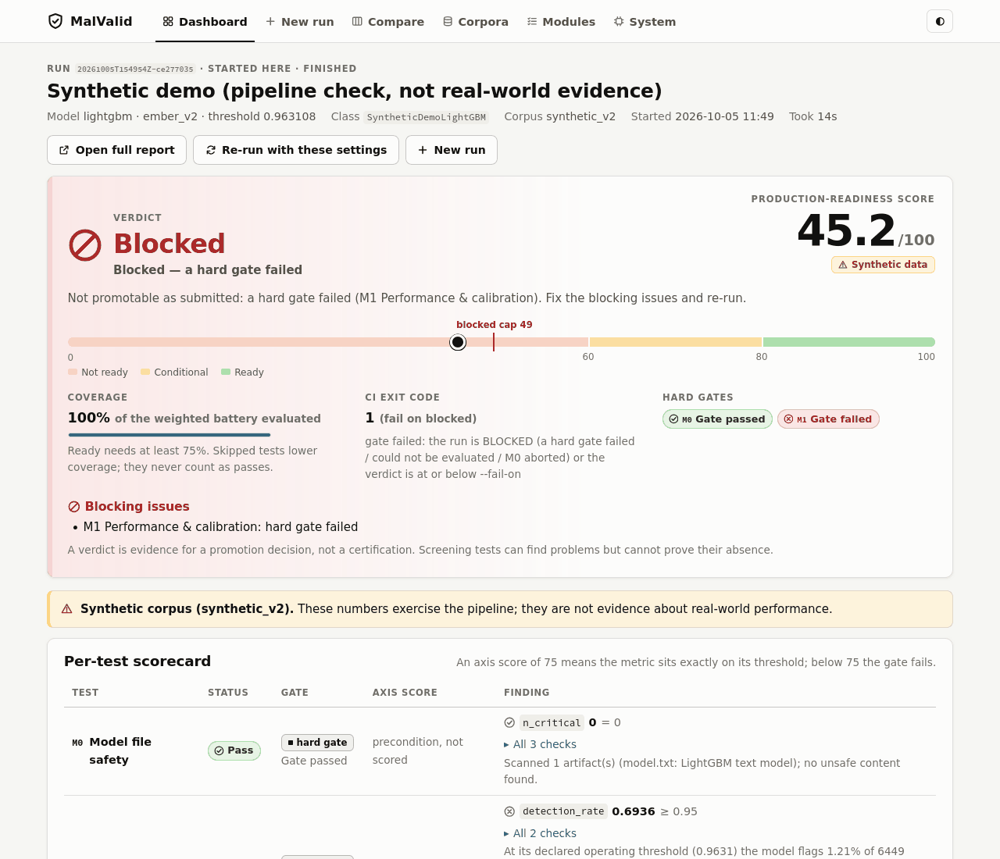

# MalValid

**A pre-deployment gate for malware-detection models: upload your model file, get a verdict and a 0-100
readiness score before you ship it.**

[](https://github.com/garvit-agarwal-purdue/MalValid/actions/workflows/ci.yml)
[](LICENSE)


You trained a malware detector. MalValid checks it against your deployment policy before you ship it. It scans the model
file before opening it, loads the model in a no-network sandbox and tests it on a fixed, hash-pinned
evaluation corpus. You get one of four verdicts (`READY`, `CONDITIONAL`, `NOT_READY` or `BLOCKED`), a 0-100
score, and the evidence behind both, in a `report.json`, a self-contained `report.html` and an exit code
that a CI job can act on.

It is built for ML and security researchers. Most submissions need **only the model file** (LightGBM,
XGBoost or ONNX); you do not have to write any code. It runs as a command-line tool or as a local web UI,
and the double-click launchers start the web UI without a Python install.

Status: `0.1.0`, alpha. Apache-2.0.

Live overview and sample report: <https://garvit-agarwal-purdue.github.io/MalValid/>



## Contents

1. [What it does](#what-it-does)
2. [Quick start (no Python needed)](#quick-start-no-python-needed)
3. [Submit your model](#submit-your-model)
4. [Test data](#test-data)
5. [The test modules](#the-test-modules)
6. [How the verdict and score are computed](#how-the-verdict-and-score-are-computed)
7. [Example results](#example-results)
8. [CLI usage](#cli-usage)
9. [Safety model](#safety-model)
10. [Limitations](#limitations)
11. [Contributing, security and citation](#contributing-security-and-citation)
12. [Licence](#licence)

## What it does

MalValid runs a battery of tests on your detector (performance, drift, training-data leakage, backdoor
screening, extraction risk and feature reliance; see [the test modules](#the-test-modules)) and combines
them into a verdict and a score.

| Verdict | Meaning |
|---|---|
| `READY` | Score of at least 80, no gate failed, and enough of the battery ran (coverage at least 75%). |
| `CONDITIONAL` | Score of at least 60, but something needs a human decision: a warning gate failed, coverage is thin, or the score is below 80. |
| `NOT_READY` | Score below 60, or nothing could be scored. |
| `BLOCKED` | A hard gate failed (by default: the false-positive or detection rate, or the file-safety scan), a test errored, or the model file was unsafe to open. The score is capped at 49. |

**What the score means.** The score is a weighted mean of per-test scores, measured against *your* policy
(a YAML file of thresholds and weights; the defaults are in
[`src/malvalid/default_gate.yaml`](src/malvalid/default_gate.yaml)). Each graded check scores at least 75 when it
passes its threshold and below 75 when it fails, so a graded check never contradicts its gate. A few checks
are ungraded (for example M2's per-window false-positive budget): they can fail the module's gate without
changing the score.
Tests that could not run (for example, because you gave no training-hash list) never count as passes:
they lower the coverage and are listed in the report.

**What it does not guarantee.**

* *Not a certificate.* Some tests are screening tests. They can find evidence of a problem, but an empty
  result does not prove the model is clean. Every report says so.
* *Not a leaderboard.* Scores compare a model with your own policy, not with other people's models.
* *Not a robustness test.* MalValid contains no evasion, adversarial-example or binary-rewriting tooling.
  Its privacy and extraction tests (M4, M6) only measure what the submitted model leaks through its own
  outputs. A `READY` verdict makes no claim that the model resists a determined adversary.
* *Not your deployment.* The numbers describe the evaluation corpus. Its class balance and time period
  differ from your traffic, so precision at a real, much lower malware prevalence will be worse.

MalValid never downloads, generates or stores malware. The corpora hold feature vectors, sha256 hashes,
labels and dates only.

## Quick start (no Python needed)

1. Download the ZIP (**Code → Download ZIP**) and extract all of it, or clone the repository:
   `git clone https://github.com/garvit-agarwal-purdue/MalValid.git`.
2. Double-click the launcher for your system:

   | System | Launcher |
   |---|---|
   | Windows 10 / 11 (x64), Windows 11 on Arm | `launchers\malvalid.bat` |
   | macOS | `launchers/malvalid.command` |
   | Linux | `launchers/malvalid.desktop`, or run `launchers/malvalid.sh` in a terminal |

3. The first start sets everything up in a private per-user folder. This takes a few minutes, needs an
   internet connection and about 1.5 GB of disk. Later starts take seconds.
4. Your browser opens on MalValid, already signed in. Click **Run the synthetic demo** to see a complete
   run and report (it evaluates the small demo model shipped in `examples/synthetic_demo/`), or upload
   your model file under **New run**.

One system library is not installed by the launcher. On **macOS**, LightGBM and XGBoost need the OpenMP
runtime from Homebrew: run `brew install libomp`. On **Windows**, they need the
[Microsoft Visual C++ Redistributable (x64)](https://aka.ms/vs/17/release/vc_redist.x64.exe), which most
PCs already have. The launcher warns at start-up if either is missing.

On Windows and macOS, models run with **reduced isolation** (see [Safety model](#safety-model)). Read
[`docs/launchers.md`](docs/launchers.md) for the first-run prompts on each system, where data is stored,
settings, uninstalling and troubleshooting.



*The synthetic demo ends `BLOCKED` with a score of 45.2 on purpose: its threshold fails the hard
false-positive and detection gate on later months. It checks the pipeline and says nothing about a real model.*

### From the command line

Python 3.11 or newer, from a source checkout. Exact, tested dependency versions are pinned in
`constraints/lock-py311.txt`.

```bash
git clone https://github.com/garvit-agarwal-purdue/MalValid.git && cd MalValid
python3.11 -m venv .venv && source .venv/bin/activate
pip install -c constraints/lock-py311.txt -e ".[onnx,featurize,web]"
malvalid --version
malvalid sandbox-check        # which isolation backends work on this machine
```

| Extra | Adds |
|---|---|
| `onnx` | ONNX models (`onnx`, `onnxruntime`) |
| `featurize` | raw-PE feature extraction (`lief`, `pefile`), only used by adapters without their own `featurize()` |
| `web` | the local web UI (`starlette`, `uvicorn`, `python-multipart`) |
| `dev` | test dependencies |

The launchers install the same three extras. Install in editable mode (`-e`) as shown: the web UI's
**Run the synthetic demo** button needs the `examples/` folder of the checkout. On Linux, install
bubblewrap (`sudo apt-get install bubblewrap`) for the full sandbox. On macOS, LightGBM and XGBoost also
need `brew install libomp`.

## Submit your model

The main path needs nothing but the model file. MalValid reads it as data (nothing is executed) to find
out what it is:

```bash
malvalid inspect-model model.txt          # kind, feature count, feature version, default corpus
malvalid run --model model.txt --threshold 0.83 \
    --training-cutoff 2024-06 --training-hashes train_sha256.txt --out runs/mine
```

**What is detected from the file** (from its content, not its extension):

| Detected | How |
|---|---|
| Model kind | LightGBM text model, XGBoost JSON or UBJSON, or ONNX (needs the `onnx` extra). |
| Number of input features | LightGBM `max_feature_idx + 1`, XGBoost `num_feature`, or the ONNX input shape. |
| Feature version | 2381 features means EMBER v2 (`ember_v2`), 2568 means EMBER v3 (`ember_v3`). Any other count is an error; use a custom adapter for other feature spaces. |
| Evaluation corpus | `ember_v2` models are tested on `ember_v2_2018`, `ember_v3` models on `ember_v3_2024`, unless you choose another with `--corpus`. |

Pickle and joblib files (for example scikit-learn models) are never unpickled to inspect them. Choose
`--model-kind` and `--feature-version` yourself and pass `--allow-pickle`, after reading the
[Safety model](#safety-model).

**Threshold.** Give the operating threshold you will ship, or let MalValid calibrate one:

| Option | Meaning |
|---|---|
| `--threshold T` | The score cut-off you ship, in [0, 1]. The false-positive and detection rates are measured at exactly this value. Choose it on your own validation data, never on the evaluation corpus. |
| `--calibrate-fpr F` | Calibrate a threshold for a target false-positive rate `F` (for example `0.005`) on a held-out slice of about 10% of the corpus's benign evaluation rows. That slice is removed from every test in the run. |
| `--calibration-period earliest\|uniform` | Which benign rows the calibrated threshold is fit on: the earliest 10% by date (default, so the threshold is tested only on later data, as in deployment), or a 10% hash sample across the whole period. |
| neither | MalValid calibrates at 0.5% false-positive rate and says so in the report warnings. |

A calibrated threshold is not your production operating point. Pass `--threshold` for a verdict on the
cut-off you actually ship.

**Optional: training cutoff and training hashes.**

| Option | Unlocks | If you skip it |
|---|---|---|
| `--training-cutoff YYYY-MM[-DD]` (newest training-sample date) | M2 drift, which scores only the time windows after the cutoff. | M2 is skipped. Coverage and the score drop, and `READY` becomes harder to reach. |
| `--training-hashes FILE` (sha256 of every training sample: one per line, or a CSV/TSV with a `sha256` column; `.gz` allowed) | M4 membership inference, and removal of your training samples from every evaluation set. | M4 is skipped, coverage drops, and any training samples that overlap the corpus stay in the evaluation and inflate the results. |

The same flow is available in the web UI: drop the model file, click **Inspect model**, choose the
threshold and the optional extras, and start the run. More detail is in
[`docs/modules/model_submission.md`](docs/modules/model_submission.md).

**Custom pipelines.** If the built-in loaders are not enough (your own featurization, preprocessing,
several model files, or another feature space), write a small Python adapter: one class that declares
`feature_version`, `model_kind`, `operating_threshold`, `training_hashes_path` and `training_cutoff` and
implements `load()` and `predict_proba()`. Check it with `malvalid validate-adapter --adapter adapter.py`,
then run `malvalid run --adapter adapter.py`. A runnable example is
[`examples/synthetic_demo/adapter.py`](examples/synthetic_demo/adapter.py); see also
[`docs/modules/loaders.md`](docs/modules/loaders.md) and the [examples index](examples/README.md).

## Test data

Every test that scores your model uses a **canonical corpus**: a directory of feature vectors, sha256
hashes, labels, first-seen dates and splits. Its content hash is pinned in MalValid and checked on load,
so two reports on the same corpus refer to the same bytes.

**The EMBER corpora are not shipped** with MalValid, and the launchers do not download them. You build
them once from the official feature releases. The synthetic corpora are generated on first use and work
out of the box.

| Corpus | Feature space | Rows | Source |
|---|---|---|---|
| `ember_v2_2018` | `ember_v2` (2381) | 1,000,000 (train 800,000, test 200,000), about 9.5 GB | EMBER2018 feature release `ember_dataset_2018_2.tar.bz2` from <https://ember.elastic.co/> |
| `ember_v3_2024` | `ember_v3` (2568) | 484,855 (test 479,987, challenge 4,868), about 5 GB; the EMBER2024 train split is left out | `Win32_test.zip`, `Win64_test.zip`, `challenge.zip` from <https://huggingface.co/datasets/joyce8/EMBER2024> (3.8 GB) |
| `synthetic_v2` / `synthetic_v3` | `ember_v2` / `ember_v3` | 20,000 each | generated on first use, no download; demo and CI only |

Pinned content hashes: `ember_v2_2018` `b76ea441be1a62197c7d19801174309e988eea54740ff22f03fa75e66beb4b98`,
`ember_v3_2024` `4f275e15e00ee11cdc67f176bbda932b3feaa92ec6d8584420cb04714e5110cc`. Builds are deterministic,
so a clean build from the official release reproduces them. Corpora are looked up in `--corpus-dir` (or
`corpus_dir` in the policy), then `$MALVALID_CORPUS_DIR/<name>`, then `~/.cache/malvalid/corpora/<name>`.

### 1. The synthetic demo (no downloads, about a minute)

```bash
cd examples/synthetic_demo
python train.py                       # train the demo LightGBM model (a few seconds)
malvalid run --model model.txt --threshold 0.963108 --training-cutoff 2017-12-28 \
    --training-hashes train_sha256.txt --config gate.yaml --out runs/demo
```

Then open `runs/demo/report.html`. The demo ends `BLOCKED` with score 45.2 and exit code 1, which is the
intended outcome (see the screenshot above). Walkthrough:
[`examples/synthetic_demo/README.md`](examples/synthetic_demo/README.md).

### 2. The real-data path (EMBER2018)

You need about 25 GB of disk and 8 or more cores. Run these commands from the repository root (if you just
ran step 1, `cd ../..` first).

```bash
# Download the feature release (1.7 GB of feature JSON, no PE files) and check it
curl -LO https://ember.elastic.co/ember_dataset_2018_2.tar.bz2
sha256sum ember_dataset_2018_2.tar.bz2   # b6052eb8d350a49a8d5a5396fbe7d16cf42848b86ff969b77464434cf2997812
tar -xjf ember_dataset_2018_2.tar.bz2    # creates ember2018/

# Build and verify the canonical corpus (about 1 minute with 8 workers, ~10 GB output)
export MALVALID_CORPUS_DIR=$HOME/malvalid-corpora
malvalid corpus build ember_v2_2018 --source ember2018/ --workers 8
malvalid corpus verify ember_v2_2018

# Gate the published EMBER2018 LightGBM model (it ships inside the tarball)
cd examples/lightgbm_ember2018
ln -sf "$(realpath ../../ember2018/ember_model_2018.txt)" ember_model_2018.txt
python make_manifest.py                  # writes train_sha256.txt (600,000 training hashes)
malvalid run --model ember_model_2018.txt --threshold 0.8336 \
    --training-cutoff 2018-10 --training-hashes train_sha256.txt --out runs/ember2018
```

### 3. EMBER2024

```bash
# The three feature zips (3.8 GB), using the Hugging Face CLI
hf download joyce8/EMBER2024 Win32_test.zip Win64_test.zip challenge.zip --repo-type dataset --local-dir ember2024
malvalid corpus build ember_v3_2024 --source ember2024/ --workers 8   # zips are streamed, never extracted
malvalid corpus verify ember_v3_2024
```

Corpus provenance and build details: [`docs/modules/corpus_ember2018.md`](docs/modules/corpus_ember2018.md),
[`docs/modules/corpus_ember2024.md`](docs/modules/corpus_ember2024.md) and
[`docs/modules/corpus_synthetic.md`](docs/modules/corpus_synthetic.md). More examples:
[`xgboost_ember2018`](examples/xgboost_ember2018/README.md) (train your own model and choose a threshold on
validation data) and [`lightgbm_ember2024`](examples/lightgbm_ember2024/README.md).

## The test modules

`malvalid list-modules` prints the live table. `--only M1,drift` runs a subset (M0 always runs) and
`--skip` removes modules.

| Code | Module | Question it answers | Needs | Default gate | Screening? |
|---|---|---|---|---|---|
| M0 | `file_safety` | Is it safe to even open the model file? A modelscan scan plus MalValid's own pickle-opcode scan, before anything is deserialized. | The model file (nothing loaded). | **hard**; any CRITICAL finding, or a pickle without `--allow-pickle`, aborts the run | No |
| M1 | `performance` | At your threshold, what are the false-positive and detection rates on held-out data, and how well calibrated is the model? Also ROC/PR, AUROC, TPR at low FPR, Brier score, ECE. | The corpus for the model's feature space. | **hard**; FPR at most 1%, detection at least 95% | No |
| M2 | `drift` | How fast does quality decay on samples that appeared after your training cutoff? TESSERACT-style time windows, AUT(F1). | Corpus plus training cutoff. | warn; AUT(F1) at least 0.70, and no window whose FPR is significantly above M1's `max_fpr` (ungraded) | No |
| M4 | `membership_inf` | Can someone with query access tell which files were in your training set? | Corpus plus training hashes. | warn; attack advantage at most 0.10 | No |
| M5 | `backdoor_screen` | Is there evidence the model was trained to wave through marked malware? Tests trigger hypotheses you supply and scans the trees for narrow rules that end in strongly benign leaves. | Tree access or the corpus. | warn; no flagged rules | **Yes**: no finding is not proof of a clean model |
| M6 | `extraction` | How cheaply could the model be cloned through its verdicts? Only relevant if it will be a queryable service. | Query access plus corpus. | warn; **off by default** | No |
| M7 | `explanation` | Do decisions rest on features an attacker can set for free, or on one dominant feature? Tree gain and SHAP, grouped by controllability. | Tree access or the corpus. | warn; controllable share at most 50%, top feature at most 30% | No (attribution only) |

M3 is not included in this release.

Each module has its own page under [`docs/modules/`](docs/modules/) with its parameters and method.

## How the verdict and score are computed

The policy lives in a YAML file. `malvalid init-config gate.yaml` writes the default policy
([`src/malvalid/default_gate.yaml`](src/malvalid/default_gate.yaml)) for you to edit, and `--config gate.yaml`
uses it. Unknown module ids or parameters are errors, so a typo cannot silently change the policy.

| Concept | Rule |
|---|---|
| Axis score | Each gated check maps its metric to 0-1 with three anchors: the **floor** scores 0, the configured **threshold** scores 0.75, the **ideal** scores 1 (linear, or log-scale for rates such as FPR). An axis with several checks takes its weakest check. |
| Score | The weighted mean of axis scores over the modules that ran, on a 0-100 scale. |
| Weights | `performance` 3, `drift` 1.5, `membership_inf` 1, `backdoor_screen` 1, `explanation` 1, `extraction` 0.5 (off by default). M0 is a precondition, not a scored axis. |
| Coverage | Weight of the modules that ran divided by the weight of the enabled modules. Skipped modules lower coverage and are listed in the reasons; they never add score. |
| `READY` | Score at least 80, no gate failed, coverage at least 0.75, and every module in `required_for_ready` (default: `performance`) ran and passed. |
| `CONDITIONAL` | Score at least 60 but not `READY`. |
| `NOT_READY` | Score below 60, or nothing could be scored. |
| `BLOCKED` | A hard gate failed or could not be evaluated, a module errored, or M0 aborted the run. The score is capped at 49. |
| Hard and warn gates | A failed **hard** gate means `BLOCKED`. A failed **warn** gate prevents `READY` but does not block; a graded warn check also lowers the score. By default only M0 and M1 are hard. |

Thresholds are your organisation's policy, not physics. Tune them deliberately and review changes like
code; relaxing a threshold to get a better verdict defeats the purpose.

## Example results

Real runs of MalValid on the example detectors and the real EMBER corpora, run on an HPC cluster node
(AMD EPYC 9654, at most 8 threads per run) with MalValid 0.1.0a1, the pre-release then named malguard.
Full breakdown, model hashes and reproduction commands:
[`docs/results/REAL_DATA_RESULTS.md`](docs/results/REAL_DATA_RESULTS.md).

| Run | Verdict | Score | Coverage | M1 FPR / DR | M2 AUT(F1) | M4 advantage | M5 flags | M7 controllable share | Wall time | Exit |
|---|---|---|---|---|---|---|---|---|---|---|
| lightgbm_ember2018 | CONDITIONAL | 80.5 | 100% | 1.00% / 96.5% | 0.977 | 0.178 (upper bound) | 0 | 39.5% (tree_shap) | 546 s | 0 |
| xgboost_ember2018 | BLOCKED | 49.0 | 100% | 0.89% / 92.5% | 0.957 | 0.136 (upper bound) | 0 | 34.1% (tree_shap) | 83 s | 1 |
| lightgbm_ember2024 (ember_v3) | BLOCKED | 49.0 | 87% | 1.28% / 97.5% | 0.980 | skipped (no manifest) | 0 | 44.7% (tree_shap) | 173 s | 1 |
| synthetic_demo (synthetic data) | BLOCKED | 45.2 | 100% | 1.21% / 69.4% | 0.808 | 0.228 | 0 | 44.7% (tree_shap) | 10 s | 1 |
| lightgbm_ember2018 + M6 | CONDITIONAL | 80.3 | 100% | 1.00% / 96.5% | 0.977 | 0.178 (upper bound) | 0 | 39.5% (tree_shap) | 594 s | 0 |
| lightgbm_ember2018, no tree access | CONDITIONAL | 77.7 | 87% | 1.00% / 96.5% | 0.977 | 0.178 (upper bound) | skipped (needs trees) | 37.0% (permutation_shap) | 255 s | 0 |

How to read them:

* The published EMBER2018 LightGBM model is `CONDITIONAL` rather than `READY` because its M4 advantage
  (0.178) is above the 0.10 limit. On EMBER2018 that number is an **upper bound**: training members and
  non-members come from different months, so part of it is drift, not leakage.
* The XGBoost model is blocked by the M1 hard gate (detection 92.5% against a 95% minimum), and the EMBER2024
  model by its declared threshold of 0.5 giving 1.28% FPR (limit 1%). Their uncapped scores were 78.1 and
  79.9.
* The published EMBER2018 model reproduces its published ROC AUC (0.996429) exactly on `ember_v2_2018`.

## CLI usage

| Command | What it does |
|---|---|
| `malvalid inspect-model FILE [--json]` | Show what MalValid detects from a model file, reading it as data only. |
| `malvalid run --model FILE [options]` | Evaluate a model file; print the verdict, score and per-test table; write `report.json`, `report.html` and `run.log` to `--out` (default `./malvalid-runs/<UTC time>`). |
| `malvalid run --adapter ADAPTER.py [options]` | The same for a custom adapter. |
| `malvalid validate-adapter --adapter ADAPTER.py` | Check an adapter against the submission contract before a full run. |
| `malvalid list-modules [--json]` | The test battery with requirements, default gates and weights. |
| `malvalid init-config [PATH] [--force]` | Write the default policy (default `gate.yaml`) to edit. |
| `malvalid corpus list` / `info NAME` / `verify NAME` / `build NAME --source DIR [--out DIR] [--workers N]` | Manage the canonical corpora. |
| `malvalid report render REPORT_JSON` | Re-render the HTML report from a `report.json`. |
| `malvalid sandbox-check [--json]` | Show which isolation backends work here. Exit 0 if at least one isolates the network. |
| `malvalid serve [options]` | Start the local web UI. |

Main `malvalid run` options (see `malvalid run --help` for all of them):

| Option | Meaning |
|---|---|
| `--model/-m PATH` or `--adapter/-a PATH` | What to evaluate (exactly one; with `--adapter`, `--model` overrides the adapter's model path). |
| `--threshold`, `--calibrate-fpr`, `--calibration-period` | The operating threshold ([above](#submit-your-model)). |
| `--training-cutoff`, `--training-hashes` | Unlock M2 and M4. |
| `--feature-version`, `--model-kind` | Override or supply what was detected (required for pickles). |
| `--config/-c`, `--corpus`, `--corpus-dir`, `--verify-corpus` | Policy and corpus selection; `--verify-corpus` re-hashes every corpus file instead of trusting the verification cache. |
| `--only`, `--skip` | Run a subset of modules (ids or codes, comma-separated). |
| `--fail-on blocked\|not_ready\|conditional` | Which verdicts exit 1 (default `blocked`). |
| `--allow-pickle` | Accept pickle-based model files (they can run code when loaded). |
| `--allow-reduced-isolation` | Where no OS sandbox exists, run the model in a plain worker process instead of refusing. |
| `--no-sandbox` | Load the model in-process with no isolation. Debugging trusted models only. |
| `--out/-o`, `--seed`, `--no-html`, `-v` | Output directory, random seed, JSON only, debug logging. |

**Exit codes of `malvalid run`:** `0` no hard gate failed and the verdict is better than `--fail-on`; `1` the
verdict is `BLOCKED` or at or below `--fail-on`; `2` a module errored, the model could not be loaded, or a
usage, configuration or adapter error.

**In CI**, build or restore the corpus once (cache `$MALVALID_CORPUS_DIR`) and gate every candidate model:

```yaml
- run: sudo apt-get update && sudo apt-get install -y bubblewrap
- run: sudo sysctl -w kernel.apparmor_restrict_unprivileged_userns=0 || true   # Ubuntu 24.04 runners
- run: pip install -c constraints/lock-py311.txt .
- run: malvalid corpus verify ember_v2_2018
- run: malvalid run --model detector/model.txt --threshold 0.83 --out runs/ci --fail-on not_ready
- uses: actions/upload-artifact@v4
  if: always()
  with: {name: malvalid-report, path: runs/ci/report.*}
```

The first two steps set up the OS sandbox, as in this repository's
[`.github/workflows/ci.yml`](.github/workflows/ci.yml): hosted Ubuntu runners lack bubblewrap and restrict the
user namespaces it needs. Without a working OS sandbox the run exits 2 unless you pass
`--allow-reduced-isolation`. Run `malvalid sandbox-check` in the job to see what is available.

**Web UI.** `malvalid serve` (needs the `web` extra) starts the UI on `127.0.0.1:8765` and prints a private
sign-in link. It offers model upload with **Inspect model**, live progress module by module, a dashboard
of past runs (including those started from the terminal) and side-by-side comparison of 2 to 6 runs. Every
run is the same `malvalid run` in a subprocess. On a remote machine, use an SSH tunnel; to reach the UI
through a portal's reverse proxy (for example Open OnDemand), see [`docs/web.md`](docs/web.md).

## Safety model

MalValid treats the submitted model (and any adapter) as untrusted input.

1. **Scan before load.** M0 scans the model file statically (modelscan plus MalValid's own pickle-opcode
   scan, including pickles inside zip and compressed joblib files) before anything is deserialized. A
   CRITICAL finding aborts the run: nothing is loaded and the verdict is `BLOCKED`.
2. **Pickle refusal.** Pickle-based files are refused unless you pass `--allow-pickle` (in the web UI, tick
   **Allow pickle-based model files**). Even then the sandboxed worker checks every global a pickle imports
   against a deny policy. Static scanning cannot prove a pickle is safe: never allow pickles whose origin
   you cannot verify. Prefer LightGBM `.txt`, XGBoost `.json`/`.ubj` or ONNX, which cannot run code on load.
3. **Sandboxed worker.** The model is loaded and queried only in a separate worker process. On Linux with
   bubblewrap, that worker has its own network namespace (no network), a read-only file system with your
   home directory hidden, one writable scratch directory, a scrubbed environment (your tokens and
   credentials do not reach it), memory and file limits, no capabilities, and a deadline per module. If
   bubblewrap is unavailable, `unshare` user namespaces isolate the network but not the file system. The
   parent never unpickles anything the worker sends: replies are length-prefixed JSON plus raw `.npy`
   arrays, validated for shape, range and type.
4. **No silent downgrade.** With the default backend (`auto`), a machine that has no OS sandbox (Windows,
   macOS, or Linux without bubblewrap or unprivileged user namespaces) makes `malvalid run` **refuse** with
   an explanation. It runs the model only if you pass `--allow-reduced-isolation` (or set
   `runtime.allow_reduced_isolation: true`). The launchers pass this flag only where it is needed: always on
   Windows and macOS, and on Linux only when `malvalid sandbox-check` finds no working sandbox.
5. **Reduced isolation, always visible.** Under reduced isolation the model still runs in a separate worker
   process with the no-unpickle channel, pickle refusal, a scrubbed environment and resource limits (a Job
   Object on Windows), but with **no network or file-system isolation**. Every report records it
   (`isolation: process_only`), and the web UI, the run page and `report.html` show a warning next to the
   verdict. It never changes the verdict or score. Use it for models you trained yourself or whose origin
   you trust; for anything else, use Linux with bubblewrap (WSL2 works on Windows).
6. **Web UI hardening.** By default `malvalid serve` binds to loopback only (a non-loopback host needs
   `--allow-remote`), requires a random per-launch access token exchanged for an `HttpOnly`,
   `SameSite=Strict` session cookie on a private per-launch `*.localhost` host name, checks the `Host`
   header against an allowlist, requires CSRF tokens on every state-changing request, sends a strict
   Content-Security-Policy, and enforces per-field upload extension lists and size limits. Reading files by
   path and running without the sandbox are disabled unless the server is started with `--allow-path-mode`
   or `--allow-no-sandbox`. The web server itself never imports an adapter, loads a model or unpickles
   anything. Details: [`docs/web.md`](docs/web.md#2-security-model).

Out of scope: kernel exploits, container escapes, side channels, and bugs in native libraries (LightGBM,
XGBoost, onnxruntime) shared with the host. To gate models that **other people** send you, run all of
MalValid inside a disposable container or VM as well. See [`SECURITY.md`](SECURITY.md) and
[`docs/modules/sandbox.md`](docs/modules/sandbox.md).

## Limitations

* **Windows and macOS are untested on real machines so far.** The server-side features the launchers rely
  on (`--find-free-port`, `--allow-reduced-isolation`, the reduced-isolation banners and the report's
  `isolation` field) are covered by unit tests, and a Windows CI job runs the fast unit tests without a
  sandbox (POSIX-only tests are skipped there). The launcher scripts themselves are not run in CI and have
  not yet been run end to end on real Windows or macOS machines. Please report problems.
* **Full isolation is Linux-only.** The OS sandbox needs bubblewrap or unprivileged user namespaces.
* **EMBER feature schemas only.** Model-file submissions support the EMBER v2 (2381 features) and EMBER v3
  (2568 features) feature spaces. Other feature spaces need an adapter plus a feature-schema and corpus
  plugin.
* **No adversarial-robustness testing.** A verdict makes no claim about evasion resistance.
* **Screening modules.** M5 can find evidence of a backdoor but not certify its absence; certification needs
  training-time access. M7 is attribution only. M6 matters only if the model is exposed as a query service.
* **EMBER2018's time split limits M2 and M4.** The train split ends in October 2018 and the test split covers
  November and December 2018, so M4 compares members and non-members from different months and reports an
  upper bound. M2 has only two monthly windows on EMBER2018, and three on EMBER2024 (the last one partial).
* **Synthetic corpora are for demos and CI.** A verdict on them says nothing about real-world readiness.
* **Numbers describe the canonical data,** not your deployment; see [What it does](#what-it-does).
* **Your threshold must come from your own validation data.** Tuning it on the gate's evaluation corpus
  inflates M1. A calibrated threshold is fit on a held-out slice that is excluded from scoring, which
  removes about 10% of the benign evaluation rows.
* **Raw-PE featurization is approximate.** The corpora are exact (built from the published feature files),
  but MalValid's own PE feature extractor, used only by adapters without their own `featurize()`, uses a
  modern LIEF and can differ from the original EMBER extractor on unusual files.
* **Tree access** (used by M5 and M7) exists for LightGBM, XGBoost, scikit-learn tree ensembles and ONNX
  tree-ensemble nodes. Other models fall back to model-agnostic methods; M5's tree scan needs tree access.

**Extending.** Test modules, feature schemas, corpora and model loaders are plugins discovered through the
`malvalid.modules`, `malvalid.feature_schemas`, `malvalid.corpora` and `malvalid.model_loaders` entry-point
groups, so no fork is needed. Evasion, adversarial-example and binary-rewriting tooling is out of scope for
this project.

## Contributing, security and citation

* **Contributing:** see [`CONTRIBUTING.md`](CONTRIBUTING.md) for the development setup and test suite
  (`python -m pytest -q`). Never attach malware to issues or pull requests.
* **Security:** please report vulnerabilities privately through
  [GitHub private vulnerability reporting](https://github.com/garvit-agarwal-purdue/MalValid/security/advisories/new),
  not in a public issue. See [`SECURITY.md`](SECURITY.md) for the threat model.
* **Changes:** [`CHANGELOG.md`](CHANGELOG.md).
* **Citation:** if you use MalValid in your research, please cite it using [`CITATION.cff`](CITATION.cff)
  (GitHub's **Cite this repository** button). If you use its corpora or temporal evaluation, please also
  cite the underlying work:
  * H. S. Anderson and P. Roth. *EMBER: An Open Dataset for Training Static PE Malware Machine Learning
    Models.* arXiv:1804.04637, 2018.
  * R. J. Joyce et al. *EMBER2024: A Benchmark Dataset for Holistic Evaluation of Malware Classifiers.*
    KDD 2025. <https://huggingface.co/datasets/joyce8/EMBER2024>
  * F. Pendlebury, F. Pierazzi, R. Jordaney, J. Kinder and L. Cavallaro. *TESSERACT: Eliminating
    Experimental Bias in Malware Classification across Space and Time.* USENIX Security 2019.

## Licence

Apache-2.0; see [`LICENSE`](LICENSE). Third-party code and data attributions are in [`NOTICE`](NOTICE) and
[`docs/_notice/`](docs/_notice/). The EMBER2018 data files are MIT-licensed; the
EMBER2024 dataset and benchmark models are Apache-2.0 (per their Hugging Face cards). Neither is
redistributed, apart from three EMBER2018 feature records embedded as unit-test data (see `NOTICE`). The
original EMBER source repository is AGPL-3.0 and MalValid does not use its code.
